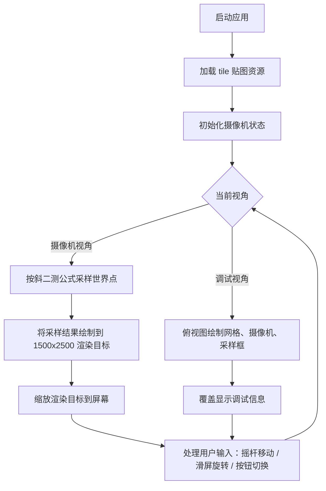

# july-24th

# 产品需求文档（PRD）— 伪 3D 2D 地图渲染器

## 1. 产品概述

一款基于 Canvas 的伪 3D 2D 地图渲染演示器。通过“斜二测”投影把由小贴图拼成的平面大地图渲染到屏幕上，支持摄像机移动、旋转、视角切换与移动端触摸操控。

- 核心目标：验证并实现用户提出的数学投影公式，构建可交互的地图浏览体验。
- 目标用户：对 2.5D 渲染、复古像素风地图感兴趣的前端/图形爱好者。

## 2. 核心功能

### 2.1 功能模块

1. **大地图渲染**
   - 由多张等尺寸小贴图（tile）无缝拼接而成的平面大地图。
   - 以原点与 tile 宽度为单位长度，tile 对齐到整数网格。
   - 贴图按“原像素大小”绘制在大地图上。

2. **摄像机系统**
   - 摄像机坐标 `(n, m)`，偏转角 `θ`。
   - 对任意世界坐标 `(x, y)`，使用用户给出的斜二测公式变换到摄像机参考系：
     - `u = [(y - m) * tanθ + (x - n)] / (sinθ * tanθ + cosθ)`
     - `v = [(y - m) - (x - n) * tanθ] / (sinθ * tanθ + cosθ)`
   - 在摄像机周围一定范围内采样世界点并投影到屏幕。
   - 渲染目标分辨率：1500 × 2500 像素（摄像机“胶片”尺寸），按屏幕尺寸缩放显示。

3. **双视角模式**
   - **摄像机视角**（默认）：使用投影公式实时渲染地图。
   - **调试视角**：俯视图，显示摄像机位置、朝向、采样范围与 tile 网格，便于观察算法行为。
   - 通过屏幕上的特殊按钮一键切换。

4. **移动端适配**
   - 所有按钮均为移动端友好的大触控区域。
   - 屏幕左下角虚拟摇杆控制摄像机前后/左右移动。
   - 屏幕中央左右滑动调整 `θ`（偏转角）。
   - 支持触摸与鼠标拖拽两种输入方式。

## 3. 核心流程

## 4. 用户界面设计

### 4.1 设计风格

- **整体调性**：工业复古 / 测绘仪器风格。深色背景、高对比度琥珀色点缀，营造“老式 CRT 雷达/战术地图”氛围。
- **主色**：深板岩灰 `#0f172a`（背景）、中灰 `#334155`（面板）、琥珀 `#f59e0b`（强调色/按钮）。
- **按钮**：圆角矩形，大触控面积（最小 56px），半透明玻璃质感，按下时轻微内凹。
- **字体**：等宽/技术感字体用于坐标显示；无衬线字体用于标签。
- **布局**：全屏 Canvas 占满视口，UI 控件悬浮在四角，不遮挡中央触控区。

### 4.2 页面设计概述

| 页面 | 模块 | UI 元素 |
|------|------|---------|
| 主渲染页 | 渲染画布 | 全屏 Canvas，自适应缩放 1500x2500 渲染目标 |
| 主渲染页 | 视角切换按钮 | 右上角大按钮，显示当前模式文字（摄像机/调试） |
| 主渲染页 | 坐标信息浮层 | 左上角半透明面板，显示 `(n, m)`、`θ`、FPS |
| 主渲染页 | 移动端摇杆 | 左下角半透明圆形摇杆，仅触摸/鼠标按下时高亮 |
| 主渲染页 | 旋转提示 | 屏幕底部中央淡色提示“左右滑动旋转视角” |

### 4.3 响应式与触控

- 桌面端：WASD / 方向键移动，鼠标在画面中央左右拖拽旋转。
- 移动端：左下角摇杆移动，屏幕中央水平滑动旋转，按钮点击切换视角。
- Canvas 始终保持全屏，渲染目标等比例缩放并居中，避免拉伸。

### 4.4 贴图资源

- 用户提供的小贴图为灰调几何/六边形瓦片纹理。
- 实现时将以 64×64 像素的 tile 纹理作为大地图单元；用户可替换 `assets/tile.png` 以使用自己的贴图。
